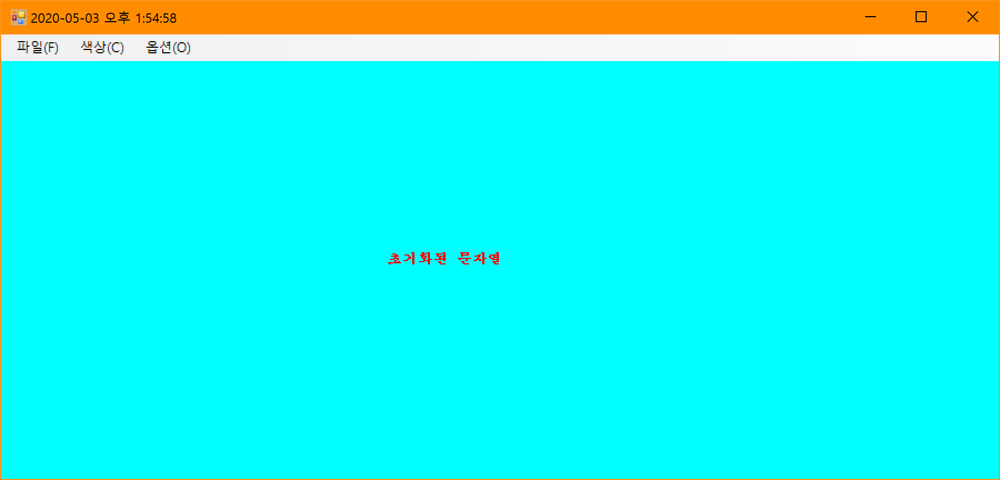
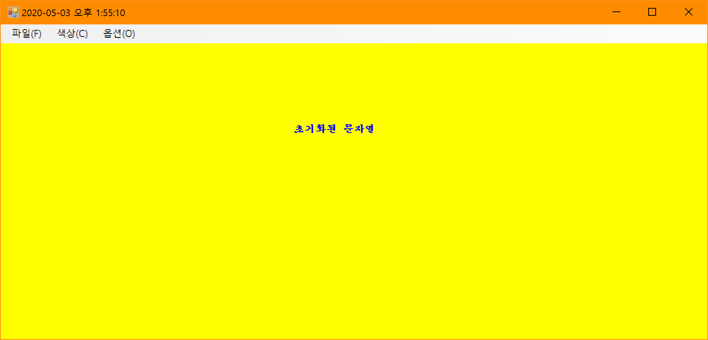
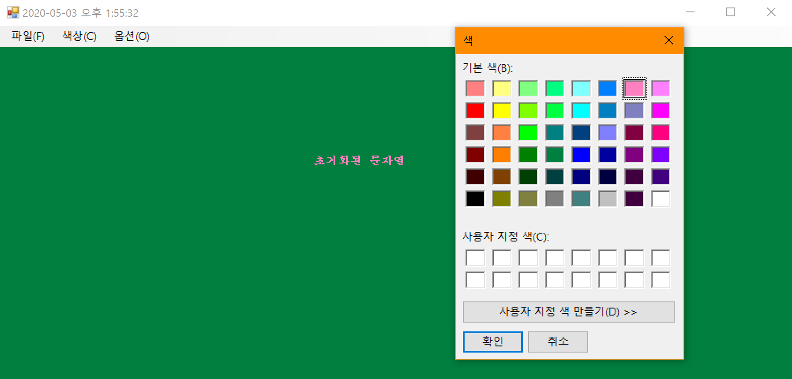
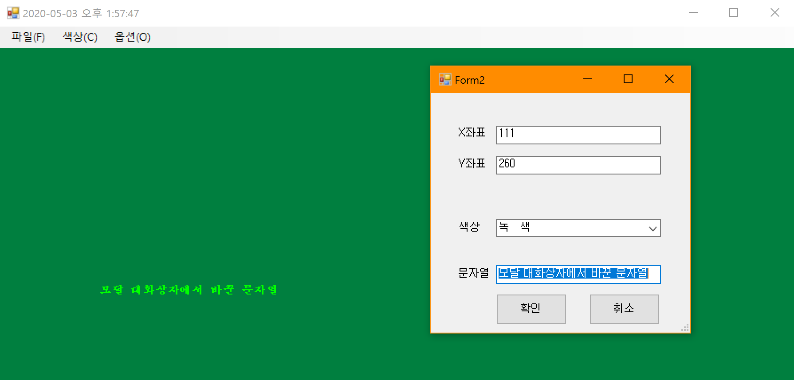

# BIT_EXPERT_WinForm_Exam
WinForm : GDI, 모달 대화상자를 이용한 문자열 출력 폼

## 개요
* 비트 고급과정 - WinForm 최종과제 : GDI, 모달 대화상자를 이용한 문자열 출력 폼
* 메인폼 영역에 마우스 클릭하면 해당 좌표에 문자열을 출력해야 함
* 문자열의 텍스트, 색상, 좌표, 크기를 속성으로 갖는 Data 클래스를 별도로 정의하여 마우스 클릭 시 Data 인스턴스에 따라 출력되어야 함
* 위 2개항목은 마우스를 클릭하고 움직였을 때도 동작되어야 함
* 색상메뉴에서 기본으로 '빨강','초록','파랑'을 정의하고 선택 시 문자열의 색상이 변경되어야 함 
* 색상메뉴에 '색상 공통 다이얼로그'를 정의하고 선택하여 팝업된 대화상자에서 임의의 색상을 선택 시 문자열의 색상이 변경되어야 함
* 색상메뉴에서 색상을 선택했을 경우 폼의 배경색을 선택한 색상의 보색으로 변경해야 함
* 옵션메뉴에서 '모달'을 선택하여 모달 대화상자를 띄우고 문자열의 출력 좌표, 색상, 텍스트를 지정할 수 있어야 함
* 위, 아래 키로 글자 크기를 2pt씩 조절가능해야 함 (위 키 : + 2pt, 아래 키 : - 2pt)
* 현재시간이 폼의 제목표시줄에 표시되어야 함

## 개발 기간
* 2017.04.21

## 기술 스택
* C#, WinForm

## 개발 환경
* OS : Windows 8.1
* IDE : Visul Studio 2017
* .NET Framework 4.5.2

## 실행 화면  
* 초기 화면  

* 색상메뉴 - '파랑' 선택 후 화면  

* 색상 공통 다이얼로그   

* 모달 대화상자  

## 실행 방법
1. 솔루션을 열고 빌드
2. 빌드된 프로그램 실행
3. 폼 임의의 영역에 마우스 클릭하여 문자열 출력확인
4. 색상메뉴에서 색상을 선택하여 문자열 색상이 바뀌는지 확인
5. 옵션메뉴에서 모달 대화상자를 띄워 문자열 텍스트 변경후 변경되는지 확인

## API 참조
* Control.MouseDown : <https://docs.microsoft.com/ko-kr/dotnet/api/system.windows.forms.control.mousedown?view=netframework-4.5.2>
* Control.MouseMove : <https://docs.microsoft.com/ko-kr/dotnet/api/system.windows.forms.control.mousemove?view=netframework-4.5.2>
* Control.KeyDown : <https://docs.microsoft.com/ko-kr/dotnet/api/system.windows.forms.control.keydown?view=netframework-4.5.2>
* Control.Invalidate() : <https://docs.microsoft.com/ko-kr/dotnet/api/system.windows.forms.control.invalidate?view=netframework-4.5.2#System_Windows_Forms_Control_Invalidate>
* BufferedGraphicsContext : <https://docs.microsoft.com/ko-kr/dotnet/api/system.drawing.bufferedgraphicscontext?view=netframework-4.5.2>
* BufferedGraphicsManager : <https://docs.microsoft.com/ko-kr/dotnet/api/system.drawing.bufferedgraphicsmanager?view=netframework-4.5.2>
* BufferedGraphics : <https://docs.microsoft.com/ko-kr/dotnet/api/system.drawing.bufferedgraphics?view=netframework-4.5.2>
* CommonDialog.ShowDialog() : <https://docs.microsoft.com/ko-kr/dotnet/api/system.windows.forms.commondialog.showdialog?view=netframework-4.5.2>
* Timer : <https://docs.microsoft.com/ko-kr/dotnet/api/system.windows.forms.timer?view=netframework-4.5.2>
